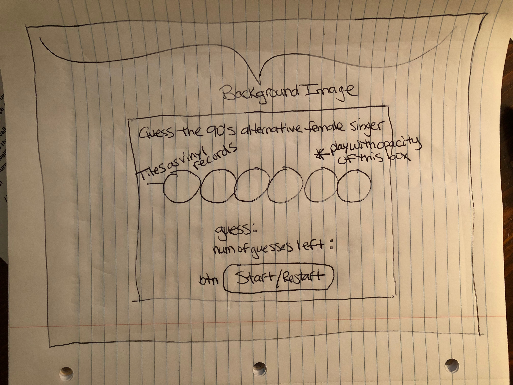

# Word Guessing Game
## Background
- Game Choice: Word Guessing Game.
-  I wanted to make the game a bit more unique so I'm choosing the catagory of 90's alternative female singer songwriters to use as the word (name) to guess.

## Wireframe



### PseudoCode
```js
- Initialize game
function gameInit() {
-	Game chooses new artist pick
-	Game chooses num of blank tiles
-	Game sets num of allowed guesses
}

function randomAnswer(names) {
    for(let) {
        const random = names[Math.floor(Math.random() * names.length)];
        return random
    }
}

- Guess letter
function guessLetter() {
    code here
-	if letter is correct, place on tile
-	else subtract number of guesses left
	
}

function results() {
-	if all letters guessed prompt winning message
-	else prompt losing message
}


function makeChoice(choice) {
-   Grab choice data
-   Store the data in a variable 
}

    
```